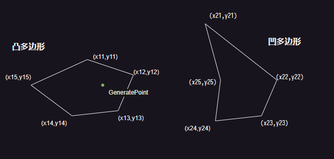

---
export_on_save:
  puppeteer: true
---

# Dragon Verse | Tables

Dragon Verse 配置表程序侧定义文档

v0.9.1  
by LviatYi

阅读该文档时，推荐安装以下字体：

- [JetBrainsMono Nerd Font Mono][JetbrainsMonoNerdFont]
- [Sarasa Mono SC][SarasaMonoSC]

## 区域 Area

|     Name     | PropName | Type    | Desc           |
| :----------: | :------- | ------- | -------------- |
|      ID      | Id       | int     |                |
|     名称     | Name     | string  |                |
|     点集     | Points   | int[][] |                |
| 是否构成形状 | IsShape  | boolean | 是否构成多边形 |

点集含义：



```json
[
    [x11,y11,x12,y12,x13,y13...x1m,y1m],
    [x21,y21,x22,y22,x23,y23...x2n,y2n],
    ...
]
```

当 isShape 为 true 时，点集将构成多边形，否则构成一系列点。

## 元素 Elemental

| Name | PropName | Type   | Desc |
| :--: | :------- | ------ | ---- |
|  ID  | Id       | int    |      |
| 名称 | Name     | string |      |

## 品质 Quality

| Name | PropName | Type   | Desc |
| :--: | :------- | ------ | ---- |
|  ID  | Id       | int    |      |
| 名称 | Name     | string |      |

## 背包物 BagItem

|   Name   | PropName   | Type    | Desc                |
| :------: | :--------- | ------- | ------------------- |
|    ID    | Id         | int     |                     |
|   名称   | Name       | string  |                     |
|   描述   | Desc       | string  |                     |
|   图标   | Icon       | string  |                     |
| 可完成性 | Achievable | boolean | 是否 可以被图鉴记录 |

## 采集物 CollectibleItem

|      Name       | PropName           | Type | Desc   |
| :-------------: | :----------------- | ---- | ------ |
|       ID        | Id                 | int  |        |
|    背包物 ID    | BagId              | int  |        |
|     品质 ID     | QualityId          | int  |        |
|   生成区域 ID   | AreaId             | int  |        |
|  最大存在数量   | ExistenceCount     | int  |        |
|    存在时间     | ExistenceTime      | int  | 秒 Sec |
|    生成间隔     | GenerationInterval | int  | 秒 Sec |
|   采集成功率    | SuccessRate        | int  | %      |
|   可采集次数    | HitPoint           | int  |        |
| 采集结果算法 ID | ResultAlgoId       | int  |        |

## 龙 Dragon

### 龙基 Dragon (Base)

|    Name     | PropName           | Type    | Desc   |
| :---------: | :----------------- | ------- | ------ |
|     ID      | Id                 | int     |        |
|    形象     | Avatar             | UNKNOWN |        |
|   元素 ID   | ElementalId        | int     |        |
|   品质 ID   | QualityId          | int     |        |
| 生成区域 ID | AreaId             | int     |        |
|  存在时间   | ExistenceTime      | int     | 秒 Sec |
|  生成间隔   | GenerationInterval | int     | 秒 Sec |
| 可捕捉次数  | HitPoint           | int     |        |
|  捕捉消耗   | Cost               | int     |        |

### 个性龙 CharacterfulDragon

|       Name        | PropName          | Type | Desc     |
| :---------------: | :---------------- | ---- | -------- |
|        ID         | Id                | int  |          |
|      龙基 Id      | DragonId          | int  | DragonID |
|     背包物 ID     | BagId             | int  |          |
| 捕捉成功率算法 ID | SuccessRateAlgoId | int  |          |

## 采集结果算法 CollectResultAlgo

| Name | PropName | Type   | Desc |
| :--: | :------- | ------ | ---- |
|  ID  | Id       | int    |      |
| 名称 | Name     | string |      |

## 捕捉成功率算法 SuccessRateAlgo

| Name | PropName | Type   | Desc |
| :--: | :------- | ------ | ---- |
|  ID  | Id       | int    |      |
| 名称 | Name     | string |      |

## 情绪状态 Emotion

|    Name    | PropName    | Type   | Desc |
| :--------: | :---------- | ------ | ---- |
|     ID     | Id          | int    |      |
|    名称    | Name        | string |      |
| 捕捉成功率 | SuccessRate | int    | %    |

## 对话 Dialogue


### 对话内容节点 DialogueContentNode

**对话内容节点** 即对「话」的抽象。

|         Name         | PropName        | Type   | Desc              |
| :------------------: | :-------------- | ------ | ----------------- |
|          ID          | Id              | int    | 对话内容节点 Id   |
|     下条内容 Id      | NextId          | int    | 子对话内容节点 Id |
|         内容         | Content         | string |                   |
|     来源角色 Id      | SourceId        | int    | 角色 Id           |
| 对话交互节点列表 Ids | InteractNodeIds | int[]  |                   |

对于 NextId Content InteractNodeIds 分别为空，配置行的含义为：

| 置空情况 | 对话框点击反馈 | 对话内容框 | 可交互列表         | 备注         |
| -------- | -------------- | ---------- | ------------------ | ------------ |
| 000      | 无             | 隐藏       | 隐藏               | 直接退出对话 |
| 001      | 无             | 隐藏       | 显示               |              |
| 010      | 退出对话       | 显示       | 隐藏               |              |
| 011      | 无             | 显示       | 显示               |              |
| ~~100~~  | ---            | ---        | ---                | 无意义的     |
| ~~101~~  | ---            | ---        | ---                | 无意义的     |
| 110      | 显示下一条     | 显示       | 隐藏               |              |
| 111      | 显示下一条     | 显示       | Content 完整后显示 |              |

### 对话交互节点 DialogueInteractNode

**对话交互节点** 象征玩家面对来自游戏角色的话语 可选择的回应。

|      Name       | PropName      | Type   | Desc              |
| :-------------: | :------------ | ------ | ----------------- |
|       ID        | Id            | int    | 对话交互节点 Id   |
| 对话内容节点 Id | ContentNodeId | int    | 子对话内容节点 Id |
|      内容       | Content       | string |                   |
| 对话节点功能 Id | FuncId        | int    | 对话节点功能 Id   |
|      图标       | Icon          | string |                   |

对于 ContentNodeId 置空性，配置行的含义为：

- 非空 跳转到对话内容节点。
- 空 直接退出对话。

### 对话节点功能 DialogueNodeFunc

定义对话节点的附带行为。

| Name | PropName | Type   | Desc |
| :--: | :------- | ------ | ---- |
|  ID  | Id       | int    |      |
| 名称 | Name     | string |      |

## 角色 Character

**角色** 包含 玩家角色 与 非玩家角色。

| Name | PropName       | Type   | Desc |
| :--: | :------------- | ------ | ---- |
|  ID  | Id             | int    |      |
| 名称 | Name           | string |      |
| 立绘 | OriginPainting | string |      |

### NPC NonPlayerCharacter

|      Name       | PropName    | Type     | Desc            |
| :-------------: | :---------- | -------- | --------------- |
|       ID        | Id          | int      |                 |
|     角色 ID     | CharacterId | int      |                 |
|    初始位置     | Position    | vector3  |                 |
|    初始旋转     | Rotation    | rotation |                 |
|      招呼       | GreetNodeId | int      | 对话内容节点 Id |
| 附属数据类型 ID | NpcDataId   | int      | Npc 附属数据 Id |

对于 GreetNodeId ，其指向一个 **对话内容节点** (DialogueContentNode)，且对于该节点的：

- NextId
- Content
- InteractNodeIds

属性存在数据校验要求，且不同值适用于不同场合。

| 置空情况 | 屏幕点击反馈 | 对话内容框 | 可交互列表         | 备注     |
| -------- | ------------ | ---------- | ------------------ | -------- |
| ~~000~~  | ---          | ---        | ---                | 无意义的 |
| 001      | 无           | 隐藏       | 显示               | **招呼** |
| 010      | 退出对话     | 显示       | 隐藏               | **打劫** |
| 011      | 无           | 显示       | 显示               | **打劫** |
| ~~100~~  | ---          | ---        | ---                | 无意义的 |
| ~~101~~  | ---          | ---        | ---                | 无意义的 |
| 110      | 显示下一条   | 显示       | 隐藏               | **打劫** |
| 111      | 无           | 显示       | Content 完整后显示 | **打劫** |

- **招呼**
  - **常用的**。
  - 不会强制锁定玩家视角。
  - 玩家可以选择交互节点 以进一步对话 从而锁定玩家视角。
- **打劫**
  - 强制锁定玩家视角。玩家被强制拉入对话。
  - 提供或不提供交互节点。
    > 到了江心 且问你吃板刀还是馄饨

### NPCData NonPlayerCharacterData

| Name | PropName | Type   | Desc |
| :--: | :------- | ------ | ---- |
|  ID  | Id       | int    |      |
| 名称 | Name     | string |      |

## 任务 Task

|      Name       | PropName        | Type    | Desc                    |
| :-------------: | :-------------- | ------- | ----------------------- |
|       ID        | Id              | int     |                         |
|      名称       | Name            | string  | 备注用 无需填入 lan_key |
|    子项目数     | Count           | int     | 完成所达成数量          |
|    可重复性     | Repeat          | boolean | 可否重复完成            |
|    完成奖励     | Reward          | int[]   |                         |
| Quest 物体 Guid | QuestObjectGuid | string  |                         |

- 完成奖励
  - `[int,int]`
  - 含义为：[**背包物品 id**,数量]
- Quest 物体 Guid
  - 构建场景时 需将 Quest 预制体拖入场景，并填入其 Guid。

[JetbrainsMonoNerdFont]: https://github.com/ryanoasis/nerd-fonts/releases/download/v3.0.2/JetBrainsMono.zip@fallbackFont
[SarasaMonoSC]: https://github.com/be5invis/Sarasa-Gothic/releases/download/v0.41.6/sarasa-gothic-ttf-0.41.6.7z
