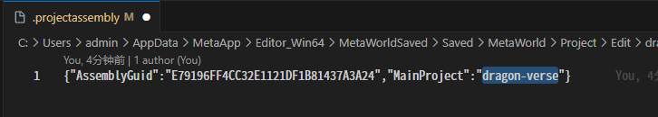
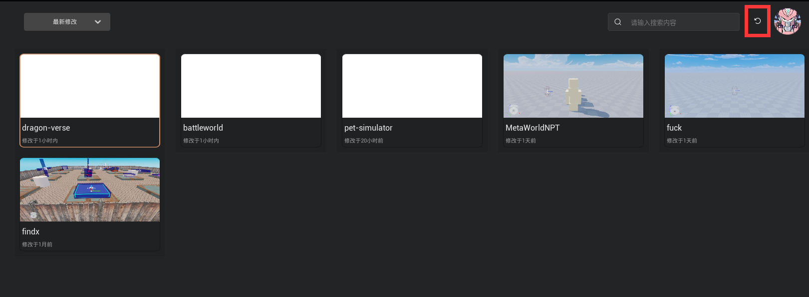

# dragon-verse

Project for Mobox

## Dev Environment

Current MetaWorld Editor version: **v0.41.0**

## Tips

### Switch Game Scenes

Allowed game scenes:

- DragonVerseNeo `dragon-verse`.
- Battle World `battleworld`.
    - External Snapshot Hash: f9d77d5e07fe252dfc9d762178172fb58c738f56
- Pet Simulator `pet-simulator`.
    - External Snapshot Hash: d58096ae5b59ed4b9e017ba4556aab1ca34c5322

Steps to switch game scenes:

1. Open the `.projectassembly` file in the root directory.
2. Change the value of the `MainProject` field to `dragon-verse`, `battleworld`, or `pet-simulator`. 
3. Save the file.
4. Exit the project, restart the Pocket Ark Editor, or click refresh. 
5. Open the project.

### Game Release Notes

#### Ensure packageName is as expected

`packageName` in `game.desc`:

- `dragon-verse`
    - `A58F8B9443AD1DA9AB492CB982467E64`
- `battleworld`
    - `1EAFD1A84470E162CD70FBB58F21CB12`
- `pet-simulator`
    - `DB4DD4B64349E9F1361EB79318839DF7`

Before updating scenes or submitting forks, ensure that the `packageName` in the `game.desc` file of each subproject folder matches the above data.

When `packageName` is inconsistent, it will cause the game to be released as a new package, affecting scene switching and other functions.

#### Game Entry Script (GameStart, GameLauncher, etc.) Strategy

For beta releases (any environment that needs to be linked to a wallet address):

|           | dv GameStart | ps GameStart | bw GameLauncher |
|-----------|--------------|--------------|-----------------|
| isRelease | ×            | ×            | ×               |
| isBeta    | √            | √            | √               |
| isOnline  | N/A          | N/A          | N/A             |
| Other     | N/A          | N/A          | N/A             |

For official releases:

|           | dv GameStart | ps GameStart | bw GameLauncher |
|-----------|--------------|--------------|-----------------|
| isRelease | √            | √            | √               |
| isBeta    | N/A          | N/A          | N/A             |
| isOnline  | N/A          | N/A          | N/A             |
| Other     | N/A          | N/A          | N/A             |

Additionally:

- isUseTestUrl: Whether to use the test URL.
    - No need to care when isRelease.
    - Check when isBeta and the external release URL is ready.

## Release Notes

```regexp
(ProjectName)(StableMaintenanceVersion)\.(IterationVersion)\.(SubIterationVersion)\.(EditorMajorVersion)\.(Year)(Month)(Day)(Hour)-((test)|(release)|(hotfix))
```

### 20250219

- S11 Season
  - Hide store
  - Modify the cost ladder for Pet upgrades
  - Add daily refresh logs for TD and Pet
  - Modify Pet
  - Optimize shortcut-related functions, including the main world and sub-games
  - Modify the format of upload logs
  - Add logs for TD endless mode

### 20250113

- S10 Season
  - Fix multiple rewards bug
  - Remove the entrance for catching elves

### 20250108

- S9 Season
  - Restore store purchase entrance
  - Add sweep tickets to the store
  - Add store shortcut keys
  - Major UI overhaul for S9
  - Hide the mode and achievements of the points competition

### 20241219 Special Season

- UI fixes
- Add mode and achievements for points competition
- Update TD task system and UI
- Update TD level selection
- Fix bug with TD sweep tickets
- Modify tip text
- Add TD sweep ticket function

### 20241211 Version 041 Adaptation

- Adaptation for editor version 041
  
### 20241210

- Update TD level configuration
- Update achievement system
- Update TD waves
- Add points competition mode for Pet
- Update warehouse UI for Pet and TD
- Update NPCs and resources
- Fix backpack refresh bug
- Optimize balance and consumption of TD sweep tickets
- Update store UI

### 20241128

- Modify TD monster wave logic
- Modify maximum waves
- Fix task system bugs
- Fix endless mode bugs
- Add room information logs for starting levels
- Optimize logic for room information errors
- Optimize multi-language
- Update task system
- Fix backend ID for starting TD game
- Update settings
- Modify stamina consumption
- Add control switch for TD lighting effects
- Optimize room information cache
  
### 20241120

- Remove shortcut key B
- Optimize logic for TD map loading errors
- Refresh card rewards in tasks
- Fix bug with clearing daily tasks
- Add Chinese GitBook link
- Update TD tower information
- Loading animation for logo
- Fix rewards for TD endless mode
- Add forced exit room function
- Update multi-language and UI
- Remove TD shortcut key E
- Add copy link button
- Dragon blessing related functions

### 20241113

- Fix TD endless talent bug
- Update Pet resources
- Settlement page UI
- Update TD map
- Modify wave interval time
- Fix initial health calculation
- Fix end time calculation

### 20241105

- Update settlement page UI and monster UI
- Optimize preloading
- TD attack sound settings
- Update and fix other TD bugs
  
### 20241031

- Update resources, levels, and multi-language settings
- Update main interface UI
- Hide settings
- Update monsters
- Update Pet UI
- Fix daily update bug

### 20241025

- Fix bug with TD game not starting successfully
- Update TD level configuration
- Update talent tree
  
### 20241016

- Modify TD character weapons
- Update monsters
- Add talent UI
- Add highlight switch for TD Boss health
- Fix wave calculation for TD endless mode
- Pet egg purchase UI
- Fix HUD UI
- Add auto-equip cards
- Update data structure for uploading game scores
- Add leaderboard function

### 20241012

- Fix bug with TD monster health recovery
- Fix talent tree values for TD endless mode
- Fix bug with killing TD Boss
- Add experience calculation
- Update Pet UI
- Update TD talent tree UI
- Add double speed function for TD
  
### 20240930

- Add retention records
- Update TD towers and talent tree
- Add logs for leaving game, entering game, monster escape, selling tower, buying tower, etc.
- Fix Pet score reporting
- Update TD monster configuration
- Update buffs
- Add logs for talent tree, tasks, and store purchases
- Update TD game manager logic
- Update TD multi-language
- Fix UI sync bug after monster escape

### 20240920

- Fix bug with level selection and health recovery
- Fix talent tree UI
- Fix death animation
- Fix bug with opening Pet backpack
- Add balance display for emdbl
- Fix Pet store UI
- Modify multi-language, text, main world UI, etc.

### 20240912

- Optimize task-related UI
- Optimize store UI
- Optimize effect unloading
- Modify BGM playback timing
- Update buff configuration
- Update blessing and tower UI
- Fix logic when diamonds are insufficient
- Modify TD map 2
- Fix bug with TD global notifications not working
- Fix main world related bugs

### 20240904

- Fix bug with TD double speed
- Add UI for displaying player card sets in the world
- Fix Pet achievements
- Fix buff activation position
- Fix logo animation effect
- Fix Pet egg purchase in the second world
- Update Pet related UI
- Fix bug with buff tower activation
- Disable online function
  
### 20240830

- Optimize and fix Pet statistics
- Optimize BGM volume control
- Update task head UI
- Fix bug with TD difficulty selection
- Optimize TD UI
- Add TD training ground map
- Fix error with killing monsters
- Regular updates for multi-language, etc.
- Add task system

### 20240823

- Optimize TD logo transition animation
- Modify player health values
- Fix Pet synthesis error
- Remove TD game start countdown function
- Add and fix TD UI
- Add TD task completion UI
- Add TD talent activation function
- Update multi-language, monster configurations, etc.
- Settlement UI
- Refactor leaderboard
- Add rewards for first victory and perfect victory in TD
- Update conversion progress

### 20240816

- Update TD maps 2 to 5
- Fix bug with double rewards
- Add price display function for the store
- Retrieve room information
- Add direct game jump
- Adapt TD tower attack range rotation
- Add blessing entrance
- Update materials and UI for all TD maps
- Add debounce for Pet egg purchase
- Regular updates for resources, multi-language, etc.
- Add TD endless mode
- Modify materials in TD game scenes
  
### 20240809

- Add UI for blessing system
- Add BGM volume adjustment
- Add game content and UI in scenes
- Fix bug with selling towers
- Add chain ID
- Add GodMod mode for talent tree
- Fix bug with TD flying monsters
- Fix bugs left over from S3 version
- Add log for user ping value
- Fix rotation-related bugs for TD towers
- Fix skill repetition bug in BW
- Fix merge bug for version 038

### 20240731

- Update talent tree
- Update scripts
- Add entrance for talent tree
- Add delay when creating games to prevent duplicate creation
- BW UI
- Pet HUD and pet UI
- Fix BW store UI
- Fix data anomalies
- BW user ID notification
- Update preloading for air walls
- Fix bugs from S2 season
- Update dragon effects
- TD value configurations
- TD endless mode data
- Fix bug with TD warm-up tower
- Update various TD UIs
- Fix client level ID error and server-side talent tree error

### 20240719 S2

- Update dragon buff icons
- Update various TD configurations
- Modify BW stamina consumption
- Modify BW skill attributes
- Update store configuration
- Add store classification rules
- Update cow level
- Add TD buff calculation rules
- Stamina recovery rules for fairy beans
- Refactor store selection types
- Update store UI
- Fix Pet online data
- Update TD tower delay time
- TD weapon configuration and position

### 20240709

- Add buffs for towers, including flight priority, increased attack power, increased attack range, warm-up, execution, etc.
- Add buffs for monsters, including berserk, split, regeneration, etc.
- Add BW store
- Add 3 new defense towers
- Add use of fairy beans
- Modify GM
- Modify BW store
- Regular modifications for scene configuration, multi-language, etc.
- Fix Pet enchantment
- Disable Pet second world
- Update login module mechanism
- Pet fusion and communication logs
- Modify Pet maximum carry capacity
- Add user operation logs for Pet

### 20240624

- Add TD Wave Util to calculate spawn logic for endless mode
- Pet hover information
- Update various Pet UIs
- Add BW token UI
- Allow skipping tutorial mode
- Restore Pet chest generation interval
- Pet enchantment function
- Fix bugs in the second world
- Change BW broadcast to user nickname
- Fix bug with gold drop rate and pickup mismatch
- Pet buff calculation
- Logic for equipping and unequipping pets
- Refactor Pet enchantment logic
- Fix bug with repeated egg opening
  
### 20240612

- Remove Pet execution logic for low health chests
- High sensitivity for operations
- Update BW GM
- Update Pet GM
- Fix bug with chest drop position
- Fix bug with mouse sensitivity not working
- Modify shared save logic
- Integrate character sound effects for BW
- Migrate Pet client logic to server to prevent cheating
- Modify Pet diamond purchasing power
- Update Pet settings UI
- Modify logic for Pet chest digging speed and gold drop amount
- Fix critical hit calculation bug

### 20240530

- Adjust Pet values
- Clear logic for BW invincibility buff
- Prohibit BW score farming logic
- Fix bug with BW leaderboard not syncing
- Fix bug with BW buffs not stacking
- Optimize BW store preview
- Optimize BW spawn points
- Add Poké Balls
- Hide logic for BW effects
- Fix bug with Pet backpack capacity
- Various modifications for Pet and BW
  
### 2.2.7.30.2024031813-beta

**Git Tag** `DragonVerse2.2.7.30.2024031813-beta`

- Removed Code verification. Removed related occupation logic.
- Moved to haunted-paradise.
- Integrated DV Rainbow Parkour data reporting interface.

### 2.2.6.30.2024030809-beta

**Git Tag** `DragonVerse2.2.6.30.2024030809-beta`

- Added specified room jump function.
- Added parkour mini-game.
- Updated scene dragon generation refresh interval.

### 2.2.5.30.2024030412-test

**Git Tag** `DragonVerse2.2.5.30.2024030412-test`

- Updated AM token process log release strategy.
- Added room selection join function.

### 2.2.4.30.2024022916-test

**Git Tag** `DragonVerse2.2.4.30.2024022916-test`

- Updated GToolkit dependency version.
- Updated AM sensitive data storage.

### 2.2.3.30.2024022913-test

**Git Tag** `DragonVerse2.2.3.30.2024022913-test`

- Fixed unexpected file loss causing game material loss.
- Updated AM to use new authentication interface in bw.
- Updated AM to delete sensitive data in pet, will try to force write in KV.

### 2.2.2.30.2024022717-hotfix

**Git Tag** `DragonVerse2.2.2.30.2024022717-hotfix`

- Added jump game GM and logs.
- Updated battle-world skill key positions.
- Updated battle-world default camera rotation speed.
- Added pet-simulator F key display controlled by trigger.
- Optimized dragon-verse stamina bar position to increase fault tolerance.
- Added pet-simulator leaderboard interface to add avatar URL.

### 2.2.2.30.2024022711-hotfix

**Git Tag** `DragonVerse2.2.2.30.2024022711-hotfix`

- Fixed dragon-verse bug where jumping was still possible when starting parkour game.
- Fixed bug where shift could not control mouse visibility.
- Added pet-simulator backpack pets to display corresponding background colors based on quality.
- Added battle-world camera rotation speed setting (to be optimized).
- Added battle-world chat window.

### 2.2.2.30.2024022615-beta

**Git Tag** `DragonVerse2.2.2.30.2024022615-beta`

- Updated pet fusion UI to add probability display.

### 2.2.1.30.2024022614-beta

**Git Tag** `DragonVerse2.2.1.30.2024022614-beta`

- Upgraded to 030.
- Fixed bugs caused by engine upgrade.

### 2.1.1.29.2024022217-beta

**Git Tag** `DragonVerse2.1.1.29.2024022217-beta`

- Upgraded to 029, fixed bugs caused by engine upgrade.
- Updated sub-game jump strategy.
- Fixed parkour bugs.
- Updated pet-simulator token interface to new URL.

### 2.0.13.28.2024020710-beta

**Git Tag** `DragonVerse2.0.13.28.2024020710-beta`

- Added parkour multi-language support.

### 2.0.12.28.2024020615-beta

**Git Tag** `DragonVerse2.0.12.28.2024020615-beta`

- Added claw machine multi-language support.
- Added parkour danger block death prompt.
- Updated certain parkour portal targets.
- Redo updated main interface to allow players to drag the view across the entire screen.

### 2.0.11.28.2024020611-beta

**Git Tag** `DragonVerse2.0.11.28.2024020611-beta`

- Updated multi-language related configurations.
- Fixed parkour death machine bug.
- Updated battle world rank GM.
- Removed default text for battle world rank overhead UI.
- Updated battle world store page buried point logs.

### 2.0.10.28.2024020515-beta

**Git Tag** `DragonVerse2.0.10.28.2024020515-beta`

- Updated main interface to allow players to drag the view across the entire screen.
- Updated battle world stamina recovery frequency.
- Updated battle world rank GM.
- Removed default text for battle world rank overhead UI.

### 2.0.9.28.2024020415-beta

**Git Tag** `DragonVerse2.0.9.28.2024020415-beta`

- Updated stamina recovery frequency and multiplier.
- Added dragon girl display for egg opening.
- Fixed issue where claw machine UI did not hide immediately when skipping.
- Updated game jump to directly paste ID.
- Fixed pet issue where object pool attributes were not cleared, causing incorrect gold pile generation.
- Removed test userId.
- Fixed issue where origin exposed model.

### 2.0.8.28.2024020114-beta

**Git Tag** `DragonVerse2.0.8.28.2024020114-beta`

- Added dragon girl avatar.
- Updated Dv Obby configuration.
- Updated Auth permission strategy.
- Updated consumption interface parameters.
- Updated claw machine configuration table.

### 2.0.7.28.2024020114-test

**Git Tag** `DragonVerse2.0.7.28.2024020114-test`

- Updated RollMachine related logic, added defense.
- Deleted room and userid display.
- Updated EnergyModule stamina recovery algorithm coefficient.
- Updated Dv Obby.

### 2.0.6.28.2024020111-test

**Git Tag** `DragonVerse2.0.6.28.2024020111-test`

- Updated AuthModule. When address token is available, use the player's token for authentication.
    - When address token is not available, manually click the currency refresh button to use the test token for retrieval.
- Updated AuthModule. Use new URL to get Mobox dragon information.
- Adapted English fonts for battleworld and pet-simulator.
- Fixed DV parkour bugs.

### 2.0.5.28.2024013114-test

**Git Tag** `DragonVerse2.0.5.28.2024013114-test`

- Updated stamina recovery algorithm to round down the number of recoveries.
- Updated dragon-verse obby.
- Added battle-world consumption related UI.
- Updated dragon ability value calculation method to use safe index.
- Fixed issue where battle-world skills could not be selected.
- Updated esc registration, normal attack key name UI display.
- Fixed pet-simulator pet bag UI element disorder.
- Updated joystick control and hidden joystick.
- Added death return city gold UI.
- Added GM command to clear currency.

### 2.0.4.28.2024013110-test

**Git Tag** `DragonVerse2.0.4.28.2024013110-test`

- Used local calculation for dragon ability values.
- Fixed uninitialized issue caused by Waterween 2.2.1 hotfix, blocking dependent animation playback.

### 2.0.3.28.2024013017-test

**Git Tag** `DragonVerse2.0.3.28.2024013017-test`

- Updated some configurations.
- Integrated battleworld UI hotkeys.
- Fixed issue where offline stamina recovery in battleworld was invalid due to one-size-fits-all deletion.
- Fixed unexpected addition caused by rounding up currency.

### 2.0.2.28.2024012915-test

**Git Tag** `DragonVerse2.0.2.28.2024012915-test`

- Fixed multi-language vacancy issue.
- Updated stamina refresh interval for non-release.
- Updated dragon ability base for non-release.
- Optimized claw machine manual operation feel.

### 2.0.1.28.2024012910-release

**Git Tag** `DragonVerse2.0.1.28.2024012910-release`

- Wrote sensitive data DSKey.

### 2.0.0.28.2024012909-release

**Git Tag** `DragonVerse2.0.0.28.2024012909-release`

- Introduced sub-game demos Pet Simulator and Battle World.

### 1.1.9.28.2024011511-release

**Git Tag** `DragonVerse1.1.9.28.2024011511-release`

- Added parkour light and dark dragon rewards, while adapting the original light and dark totem rewards to ensure only 1 light dragon and 1 dark dragon in the end.

### 1.1.8.28.2024011217-hotfix

**Git Tag** `DragonVerse1.1.8.28.2024011217-hotfix**

- Fixed multi-language text being too long.

### 1.1.7.28.2024011215-release

**Git Tag** `DragonVerse1.1.7.28.2024011215-release**

- Fixed incorrect sprint effect UI visibility configuration.
- Added movement check during sprint.
- Added stamina indicator.
- Added multi-language support for AuthModule prompts.

### 1.1.6.28.2024011213-hotfix

**Git Tag** `DragonVerse1.1.6.28.2024011213-hotfix**

- Introduced i18nTs 1.5.3b.
- Updated MainPanel multi-language initialization timing.
- Fixed mistakenly deleted speed UI effects.

### 1.1.5.28.2024011118-hotfix

**Git Tag** `DragonVerse1.1.5.28.2024011118-hotfix**

- Updated MainPanel acceleration effect UI.
- Added stamina.
- Changed language selection GS attribute for non-release.
- Updated right-click as sprint key.
- Added MainPanel key prompts.

### 1.1.4.28.2024011118-hotfix

**Git Tag** `DragonVerse1.1.4.28.2024011118-hotfix**

- Fixed canvas UI occlusion issue.

### 1.1.3.28.2024011117-release

**Git Tag** `DragonVerse1.1.3.28.2024011117-release**

- Added swimming area leap function.
- Added sprint and effects.
- Added footstep sound binding.
- Added Japanese support.

### 1.1.2.28.2024011009-hotfix

**Git Tag** `DragonVerse1.1.2.28.2024011009-hotfix**

- Updated backpack interface icons.
- Updated walking sound rate.

### 1.1.1.28.2024010720-hotfix

**Git Tag** `DragonVerse1.1.1.28.2024010720-hotfix**

- Urgently fixed Quest data version issue.

### 1.1.0.28.2024010716-hotfix

**Git Tag** `DragonVerse1.1.0.28.2024010716-hotfix**

- Adjusted background music volume.

### 1.0.9.28.2024010714-release

**Git Tag** `DragonVerse1.0.9.28.2024010714-release**

- Adjusted magic circle transform.
- Adjusted background music volume.
- Fixed unexpected countdown not decrementing.
- Fixed issue where reset was allowed during parkour.

### 1.0.8.28.2024010712-test

**Git Tag** `DragonVerse1.0.8.28.2024010712-test**

- Fixed issue where continuous clicking of capture button caused animation blockage.
- Disabled illustration shortcut key.
- Opened parkour mini-game entrance for testing.

### 1.0.7.28.2024010519-test

**Git Tag** `DragonVerse1.0.7.28.2024010519-test**

- Attempted to fix parkour mini-game portal configuration issue.
- Fixed animation tween removal causing stuttering issue.
- Added issue where all materials were messed up.

### 1.06.28.2024010518-hotfix

**Git Tag** `DragonVerse1.06.28.2024010518-hotfix**

- Attempted to fix parkour mini-game portal configuration issue.
- Closed parkour mini-game entrance.
- Updated scene dragon capture issue where quick clicking of capture button caused lock to remain locked.

### 1.05.28.2024010517-hotfix

**Git Tag** `DragonVerse1.05.28.2024010517-hotfix**

- Updated partner dragon super boundary refresh issue.
- Attempted to fix parkour mini-game portal configuration issue.
- Prioritized loading capture background image.

### 1.04.28.2024010514-release

**Git Tag** `DragonVerse1.04.28.2024010514-release**

- Fully investigated 028 data disorder causing portal attribute auto-reset issue.
- Updated light and dark dragon triggers.
- Replaced unsafe setDesc.
- Updated MainPanel.
- Updated AuthModule to add player records.
- Set partner dragon swimming speed.
- Added pathfinding area.

### 1.03.28.2024010420-release

**Git Tag** `DragonVerse1.03.28.2024010420-release**

- Upgraded to 028.

### 1.0.2.27.2024010419-hotfix

**Git Tag** `DragonVerse1.0.2.27.2024010419-hotfix**

- Fixed 028 serialization noise causing fire dragon trigger misalignment.

### 1.0.1.27.2024010418-hotfix

**Git Tag** `DragonVerse1.0.1.27.2024010418-hotfix**

- Fixed fire hell scene loophole.

### 1.0.0.27.2024010417-release

**Git Tag** `DragonVerse1.0.0.27.2024010417-release**

- Added random Bgm.
- Added backpack module guard to prevent backpack page failure caused by quick switching of backpack during loading.
- Updated light and dark dragon trigger.

### v0.9.8.27.2024010412-test

**Git Tag** `DragonVerse0.9.8.27.2024010412-test**

- Fixed 028 engine configuration noise causing unexpected NPC.
- Disabled dragon girl follow during parkour.

<!-- - Expected to disable UE console.-->

- Fixed git conflict causing UI not submitted, resulting in fireball effect bug when clicking continuously.
- Added light and dark totem prompt bubble.
- Disabled automatic localization switch for Japanese and German.

### v0.9.7.27.2024010318-release

**Git Tag** `DragonVerse0.9.7.27.2024010318-release**

- Fixed light and dark dragon. Reconfigured table.
- Fixed earth dragon table.
- Fixed puppet wing effect not displaying issue.

### v0.9.6.27.2024010317-test

**Git Tag** `DragonVerse0.9.6.27.2024010317-test**

- Updated dragon table, fixed puppet 028 engine not playing effect bug.
- Fixed earth dragon prompt UI not displaying issue.
- Fixed puppet fireball effect not displaying issue.
- Adjusted sub-game broadcast information timing.
- Eliminated effect debugging lines.

### v0.9.5.27.2024010315-test

**Git Tag** `DragonVerse0.9.5.27.2024010315-test**

- Updated new SubGameInfo Report encryption method.
- Fixed known issue where portal trigger position shifted.

### v0.9.4.27.2024010314-test

**Git Tag** `DragonVerse0.9.4.27.2024010314-test**

- Updated a series of SpawnScript GameObject mounting methods.
- Added sub-game reporting and GmPanel test interface.
- Updated PickController generation timing.
- Updated MainPanel prompt and collection progress bar UI to be centered in full screen.

### v0.9.3.27.2024010311-test

**Git Tag** `DragonVerse0.9.3.27.2024010311-test**

- Fixed issue where responsive data was not initialized when player joined, causing initial DragonBall count to be 0.
- Black magic fixed issue where ball lifting UI did not appear, preventing ball lifting game.
- Opened parkour, light and dark totem mini-games.

> So, Gul'dan, what is the price?

### v0.9.2.27.2024010309

**Git Tag** `DragonVerse0.9.2.27.2024010309**

- Fixed issue where responsive data was not initialized when player joined, causing initial DragonBall count to be 0.

### v0.8.9.2024010214

**Git Tag** `DragonVerse0.8.9.2024010214**

- Fixed issue where partner dragon was forced to teleport face-to-face.

### v0.8.8.2024010211

**Git Tag** `DragonVerse0.8.8.2024010211**

- Automatically switch language based on localization.
- Prioritized loading issue.
- Updated MainPanel avatar UI.
- Updated Nolan 0.5.0a.
- Fixed issue where test overhead UI was displayed.
- Added mouse wheel control for camera distance.
- Added forced lock for graphics quality.

### v0.8.7.2024010209

**Git Tag** `DragonVerse0.8.7.2024010209**

- Fixed ball lifting key conflict.
- Fixed issue where cosmic ray particle impact on mw editor caused robustness surge, preventing BeginnerGuard from initializing properly.

### v0.8.6.2023122917

**Git Tag** `DragonVerse0.8.6.2023122917**

- Updated scene dragon destruction to distinguish between natural death double effects.

### v0.8.5.2023122917

**Git Tag** `DragonVerse0.8.5.2023122917**

- Updated scene dragon birth timing and effects.
- Updated scene dragon destruction timing and effects.
- Fixed Auth frequency guard not implementing Hour check issue.
- Updated BeginnerGuard to remove unnecessary triggers.

### v0.8.4.2023122818

**Git Tag** `DragonVerse0.8.4.2023122818**

- Fixed issue where partner dragon could not move in non-pathfinding areas.
- Fixed overhead UI not displaying issue.
- Fixed overhead UI numeric name display issue.

### v0.8.3.2023122717

**Git Tag** `DragonVerse0.8.3.2023122717**

- Updated parkour mini-game process and experience.

### v0.8.2.2023122716

**Git Tag** `DragonVerse0.8.2.2023122716**

- Fixed overhead pure numeric UI display issue.

### v0.8.1.2023122715

**Git Tag** `DragonVerse0.8.1.2023122715**

- Added birth check for generated objects.
- Double-sided processing for water shader.
- Hidden Code UI.
- Added null defense for generation points.
- Updated UnifiedRoleController to integrate PlayerState.
- Updated multi-language to adapt to German.
- Added sub-game reward prompt.
- Added redundancy for wood dragon defense.
- Evaluated and updated scene dragon generation strategy. Updated table.
- Maintained stereo sound effects.
- Fisher–Yates shuffle algorithm for personalized dragon generation.
