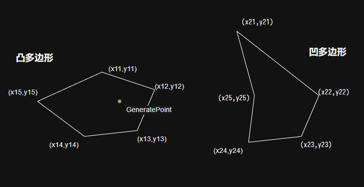

---
export_on_save:
  puppeteer: true
---

# Dragon Verse | Req Ana

Dragon Verse 需求分析及设计文档

v1.0.7  
by LviatYi

阅读该文档时，推荐安装以下字体：

- [JetBrainsMono Nerd Font Mono][JetbrainsMonoNerdFont]
- [Sarasa Mono SC][SarasaMonoSC]

若出现乱码，其为 Nerd Font 的特殊字符，不影响段落语义。

## Origin ⠄⠄⠄⠄⠄⠄⠄⠄⠄⠄⠄⠄⠄⠄⠄⠐⠒⠒⠒⠒⠚⠛⣿⡟⠄⠄⢠⠄⠄⠄⡄⠄⠄⣠⡶⠶⣶⠶⠶⠂⣠⣶⣶⠂⠄⣸⡿⠄⠄⢀⣿⠇⠄⣰⡿⣠⡾⠋⠄⣼⡟⠄⣠⡾⠋⣾⠏⠄⢰⣿⠁⠄⠄⣾⡏⠄⠠⠿⠿⠋⠠⠶⠶⠿⠶⠾⠋⠄⠽⠟⠄⠄⠄⠃⠄⠄⣼⣿⣤⡤⠤⠤⠤⠤⠄⠄⠄⠄⠄⠄⠄⠄⠄⠄⠄⠄⠄⠄⠄⠄

[策划需求文档][dragon-verse-case]

## Module ⠄⠄⠄⠄⠄⠄⠄⠄⠄⠄⠄⠄⠄⠄⠄⠐⠒⠒⠒⠒⠚⠛⣿⡟⠄⠄⢠⠄⠄⠄⡄⠄⠄⣠⡶⠶⣶⠶⠶⠂⣠⣶⣶⠂⠄⣸⡿⠄⠄⢀⣿⠇⠄⣰⡿⣠⡾⠋⠄⣼⡟⠄⣠⡾⠋⣾⠏⠄⢰⣿⠁⠄⠄⣾⡏⠄⠠⠿⠿⠋⠠⠶⠶⠿⠶⠾⠋⠄⠽⠟⠄⠄⠄⠃⠄⠄⣼⣿⣤⡤⠤⠤⠤⠤⠄⠄⠄⠄⠄⠄⠄⠄⠄⠄⠄⠄⠄⠄⠄⠄

模块是游戏功能的抽象性概括，与 mw Module 无关。

> 总预计人时：  
> **16.5MD** +6.5MD

---

### 认证

> **0.25MD** +0.25MD 认证验证.  
> **0.25MD** +0.25MD 权限应用.  
> **0.25MD** +0.25MD 认证模块 UI.

**认证 (Auth)** 模块用于用户 Code 验证，验证以开放 **权限**。

Auth 通过 Https 通信向远端验证 api，这需要与服务端配合。

**权限** 是一组 状态、物品或功能 的集合，其能够被 **给予** 或 **收回**，分别对应两种行为，其拥有其他任何模块的物品及状态的增删能力。

#### 权限

- 准入权限
  - 允许玩家使用自己创建的形象.
  - 给予宠物龙
  - UI 与功能解锁
  - 允许出新手村 空气墙颜色变为绿色
  - 关闭 Code 验证功能

#### 认证 UI

- 文本输入框
- 提交按钮
- 等待动画
- 错误提示
- 超时提示
- 成功提示

---

### 形象

> **0.5MD** +0.25MD

**形象 (Avatar)** 模块用于形象数据维护。

---

### 玩家

> **0.5MD** +0.25MD

**玩家控制器** 模块用于控制玩家行为，包括但不限于：

- 玩家状态处理。
  - 行动能力
  - 状态管理器
  - 姿态动画
- 行动处理
  - 移动
  - 交互
- 主界面
  - 功能入口
  - 功能控制

---

### 宠物龙

> **0.5MD** +0.25MD 宠物龙数据层.  
> **1MD** +0.5MD 宠物龙 AI.  
> **1.5MD** +0.5MD 宠物龙运动模块.  
> **1.5MD** +0.5MD 宠物龙行为模块及 UI.

**宠物龙 (Dragon)** 模块用于管理龙的所有数据。

龙对象 是一个拥有自主跟随能力的物体，其能够跟随玩家的位置而移动。

龙模块 将控制龙的行为，包括但不限于：

- 龙状态处理。
  - 行动能力
  - 状态管理器
  - 姿态动画
- 智能
  - 接入行为树的行为管理

#### 宠物龙 运动模块

运动模块 是龙的一个子模块，用于控制龙的运动轨迹。

其输入玩家位置、其他龙位置信息，输出平滑的自身预期 transform，并进行到该节点。

#### 宠物龙 行为模块

行为模块 是龙的一个子模块，用于控制龙的行为表现。

其输入行为树所输出的状态，输出对应的行为表现，包括但不限于：

- 目标姿态动画

> NOTE 策划案需求定义模糊。

宠物龙的行为具有四种状态：

- **跟随**
  - 当超出 **懒惰距离** 时进入跟随状态。
  - 以玩家周围某点作为目的地。
  - 具有一系列属性，以决定宠物龙行为：
    - 平稳速度
    - 最大速度
    - 加速度
    - 减速度
    - 平稳减速度
    - 旋转速度
    - 追赶触发距离
      - 进入 追赶 / 平稳
    - 懒惰距离
    - 最大跟随距离
      - 触发传送
  - 当到达目的地后退出跟随，进入原地待机。
- **待机**
  - 呼吸
  - 休闲
- **说话**
  - 可与其他状态并行。
  - 播放声音与字幕。

---

### 交互

**交互 (Interaction)** 模块用于处理玩家与交互物的交互行为。

交互物指达成某些条件后触发固定演出并提供交互决策选项的物体。

交互模块 将控制交互物 UI 与交互操作，包括但不限于：

- UI 状态处理。
- 玩家状态管理。
- 交互物通信。

---

### 采集物

> **1MD** +0.25MD 采集物数据层.  
> **0.5MD** +0.25MD 采集物生成.  
> **1MD** +0.25MD 采集物交互及 UI.

**采集物 (CollectibleItem)** 是一种交互物，其可被玩家 **采集**，采集 将触发采集演出。采集物有不同类型。每种类型和存在多个 **采集物实例**。

- **ID** Id
  - 主键。
- **名称** Name
  - 名称。
- **品质** Quality
  - 一种采集物的附带标签，允许在不同的场景中进行区分。
  - 不同标签 **推荐 RECOMMENDED** 作为不同的表项。
- **生成区域** GenerationRange
  - 采集物生成的区域，采集物实例将在区域内的随机坐标点生成。
  - 生成区域是一个一维数组，其中保存 **区域 ID**。
  - 区域 中的 Range 属性是一个二维数组。
  - [[x11,y11,x12,y12,x13,y13...x1m,y1m],[x21,y21,x22,y22,x23,y23...x2n,y2n]...]
    > 
  - 建议使用凸多边形，可以降低算法开发成本。
- **最大存在数量** ExistenceCount
  - 采集物所生成的实例 在整个世界地图中 最大同时存在数量。
- **最大存在时间** ExistenceTime
  - 采集物实例的最大存在时间。
  - 达到存在时间时采集物将销毁。
- **生成间隔** GenerationInterval
  - 与 上一次同种采集物的 生成时间的 间隔。
- **采集成功率** SuccessRate
  - 玩家采集行为结果为成功的概率。
- **可采集次数** HitPoint
  - 采集物实例可被采集的总次数。
  - 当玩家 **成功采集** 时 -1，当 0 时采集物销毁。
  - 玩家独享的。
  <!-- - **可采集总次数** GlobalHitPoint
  - 采集物所有实例累计可被采集的次数。
  - 超过该次数将不会再刷出。 -->
- **采集结果算法 ID** ResultAlgoId
  - 采集结果行为的 标识符.
  - 由程序定义采集结果具体算法.
  <!-- - **刷新时间** GenerationTimeRange
  - 指定的时间段内才会触发刷新。 -->

程序侧预定义配置表:  
[采集物 CollectibleItem | Dragon Verse | Tables][dragon-verse-tables-collectible]  
[区域 Area | Dragon Verse | Tables][dragon-verse-tables-area]

当采集物实例未达 **最大存在数量** 时，将进行生成。生成需要满足以下条件：

- 满足 **生成范围**
- 满足 **生成间隔**

具有两种方案进行生成调用：

- [ ] RECOMMENDED 固定频率 (2s) 调用。
- [ ] 由上一次采集物实例销毁调用。（新建房间不存在任何采集物实例，另需定义新建时生成逻辑）

除非特殊需求，不建议策划定义刷新时机。

### 场景龙

> **0.5MD** +0.25MD 场景龙数据层.  
> **0.5MD** +0.25MD 场景龙生成.  
> **1.5MD** +0.5MD 场景龙交互及 UI.  
> **1MD** +0.25MD 场景龙行为 Ai 及 表现.  
> **0.5MD** +0.25MD 场景龙情绪 Ai 及 表现.

场景龙 是一种交互物，其可被玩家 **捕捉**，捕捉 将触发捕捉演出。场景龙有不同类型。每种类型和存在多个 **场景龙实例**。

- **ID** Id
  - 主键。
- **名称** Name
  - 名称。
- **形象** Avatar
  - 在场景中的形象。
- **元素 ID** Elemental
  - 一种场景龙的附带标签，允许在不同的场景中进行区分。
  - 不同标签 **推荐 RECOMMENDED** 作为不同的表项。
- **品质** Quality
  - 一种场景龙的附带标签，允许在不同的场景中进行区分。
  - 不同标签 **推荐 RECOMMENDED** 作为不同的表项。
- **生成区域** GenerationRange
  - 场景龙生成的区域，场景龙实例将在区域内的随机坐标点生成。
  - 生成区域是一个一维数组，其中保存 **区域 ID**。
  - 区域 中的 Range 属性是一个二维数组。
  - [[x11,y11,x12,y12,x13,y13...x1m,y1m],[x21,y21,x22,y22,x23,y23...x2n,y2n]...]
    > 
  - 建议使用凸多边形，可以降低算法开发成本。
- **生成间隔** GenerationInterval
  - 与 上一次同种场景龙的 生成时间的 间隔。
- **最大存在时间** ExistenceTime
  - 场景龙实例的最大存在时间。
  - 达到存在时间时场景龙将销毁。
- **可捕捉次数** HitPoint
  - 场景龙实例可被捕捉的总次数 一般为 1。
  - 当玩家 **成功捕捉** 时 -1，当 0 时场景龙销毁。
  - 所有玩家共享的，可被竞争的。
- **捕捉消耗** Cost
  - 捕捉的消耗。
  - 目前为 DragonBall。
- **捕捉成功率算法** SuccessRateAlgo
  - 玩家捕捉行为结果为成功的概率的 计算方式的 标识符。
  - 由程序定义捕捉成功率算法.

#### 捕捉

当玩家满足待捕捉条件时，进入 **待捕捉态**：

- 场景龙对象上弹出 **锁定 UI**。

当选中龙距离超过指定范围，则退出待捕捉态。

玩家通过 UI 锁定指定的 场景龙 后，进入 **捕捉挑战**：

- MainPanel 显示 **捕捉控件**。
- **捕捉控件** 是一组 UI ，包含一个来回摆动的指针。
- 指针在这阶段将来回摆动（摆动定义暂缺）

玩家点击捕捉控件中的按钮，进入 **捕捉挑战结果展示**：

- **捕捉控件** 的指针将停止运动，并保持在当前位置。
- 根据指针的位置：
  - 飘字 `Prefect` 或 `Bad` 。
  - 只有观赏作用 无任何其他影响。
- 执行捕捉后台计算流程。
- 同时 **捕捉控件** 中的进度条开始读条直到完成，线性，共计 2 秒。

2 秒后进入 **捕捉结果展示**。

- MainPanel 隐藏 **捕捉控件**。
- 当成功时：
  - Prompt 提示：`捕捉成功`。
- 当失败时：
  - Prompt 提示：`捕捉失败`。
  - 重新进入 **待捕捉态**。

#### 场景龙 行为

场景龙的行为具有两种状态：

- **待机** Idle 无目的 默认的
  - 呼吸
  - 休闲
- **闲逛** Stroll 通过自动寻路确立一个目的地
  - 行走
  - 奔跑

Idle 一段时间后进入 Stroll。 Stroll 达到目的地后进入 Idle。

场景龙的情绪具有四种状态。

| 情绪状态             | 捕捉成功概率 |
| -------------------- | ------------ |
| **机警的** Tense     | 很低         |
| **敏锐的** Nervous   | 低           |
| **放松的** Relaxed   | 中           |
| **烦闷的** Bored     | 高           |
| **疲惫的** Exhausted | 较高         |

> NOTE **不要在策划文档里使用非标准的词汇。**

暂未定义流动条件。

---

### 背包

> **0.5MD** +0.25MD 背包数据层及 UI.

**背包 (Bag)** 模块用于存储玩家被给予的任何存在。同时提供一个可供交互的 UI 界面，用于展示被给予的、可被观察的存在。

**存在** 包括但不限于：

- 权限所影响的全局状态。
- 收集的物品。

#### 背包数据

- 金币
- 背包物品

---

### 图鉴

> **0.5MD** +0.25MD 图鉴数据层及 UI.

**图鉴 HandBook** 模块记录玩家已经达成的目标点。其提供一个用于展示的 UI 界面。

图鉴可以记录：

- 已捕捉龙

---

### NPC

> **2MD** +0.5MD NPC 数据层及 UI.

**NPC** 模块用于控制玩家与 NPC 的交互。

NPC 是一种交互物，其可与玩家 **对话**。其展示一些对话或功能选项，并允许玩家选择。

> NOTE 策划案需求定义模糊。

---

### 设置

> **0.75MD** +0.25MD 设置模块数据、功能及 UI.

**设置 PlayerSetting** 模块开放一些接口，允许玩家对游戏属性进行设置。

- Avatar 设置\*
- 头像更换\*
- 昵称修改\*
- 多语言切换
- 音乐开关 / 调节
- 音效开关 / 调节

\* 不在游戏程序内提供的。

---

### 子游戏

UNKNOWN INCLUDE ALL.

> NOTE 策划案需求定义模糊。

## Technology ⠄⠄⠄⠄⠄⠄⠄⠄⠄⠄⠄⠄⠄⠄⠄⠐⠒⠒⠒⠒⠚⠛⣿⡟⠄⠄⢠⠄⠄⠄⡄⠄⠄⣠⡶⠶⣶⠶⠶⠂⣠⣶⣶⠂⠄⣸⡿⠄⠄⢀⣿⠇⠄⣰⡿⣠⡾⠋⠄⣼⡟⠄⣠⡾⠋⣾⠏⠄⢰⣿⠁⠄⠄⣾⡏⠄⠠⠿⠿⠋⠠⠶⠶⠿⠶⠾⠋⠄⠽⠟⠄⠄⠄⠃⠄⠄⣼⣿⣤⡤⠤⠤⠤⠤⠄⠄⠄⠄⠄⠄⠄⠄⠄⠄⠄⠄⠄⠄⠄⠄

---

### Https 通信

需要调用 Https Api，进行与服务提供者的交流。

---

### 行为树

行为树模块，用于定义可复用 AI。

### 动态切换

- 采集。相关的动态组件默认全部隐藏.

  - 采集成功时: MainPanel 界面的图片控件 OperationSuccessful 显示出来，文本控件 OperationalFeedback 显示的文字内容为 Collection_002。1 秒后开始渐隐，至 1.5 秒完全透明并消失。
  - 采集失败时: MainPanel 界面的图片控件 OperationFailed 显示出来，文本控件 OperationalFeedback 显示的文字内容为 Collection_003，1 秒后开始渐隐，至 1.5 秒完全透明并消失。

- 捕捉龙娘。相关的动态组件默认全部隐藏。

  - 捕捉成功时: MainPanel 界面的图片控件 OperationSuccesful 显示出来，文本控件 OperationalFeedback 显示的文字内容为 Catch_002。1 秒后开始渐隐，至 1.5 秒完全透明并消失。
  - 捕捉失败时: MainPanel 界面的图片控件 OperationFailed 显示出来，文本控件 OperationalFeedback 显示的文字内容为 Catch_003。1 秒后开始渐隐，至 1.5 秒完全透明并消失。
  - 按下捕捉按钮指针停在黄色焦点区域时: 飘字提示 Catch_005，飘字表现效果待美术同事上传。
  - 按下捕捉按钮指针停在非黄色焦点区域时:飘字提示 Catch_006，飘字表现效果待美术同事上传。

- 龙娘跟随状态切换。在没有选中龙娘的情况下，相关的动态组件默认全部隐藏。
  - 若选中的龙娘已经是跟随状态，则“休息"按钮显示，"跟随“按钮保持隐藏。即 BagMain 界面的 mtnOpt1_2 按钮(文本为 Bag_005)显示 mBtnOpt1_1 按钮(文本为 Bag_004)隐藏。
  - 若选中的龙娘是休息状态，则"跟随”按纽显示，"休息”按钮保持隐藏。即 BaqMain 界面的 mBtnOpt1 1 按钮(文本为 Bag_004)显示，mBtnOpt1_2 按钮(文本为 Bag_005)隐藏。

[JetbrainsMonoNerdFont]: https://github.com/ryanoasis/nerd-fonts/releases/download/v3.0.2/JetBrainsMono.zip@fallbackFont
[SarasaMonoSC]: https://github.com/be5invis/Sarasa-Gothic/releases/download/v0.41.6/sarasa-gothic-ttf-0.41.6.7z
[dragon-verse-case]: https://brainvat.sg.larksuite.com/wiki/JhMbw2RmjiNDGPkL7fglaojrgEc
[dragon-verse-tables-collectible]: ./tables.md#采集物-collectibleitem
[dragon-verse-tables-area]: ./tables.md#区域-Area
