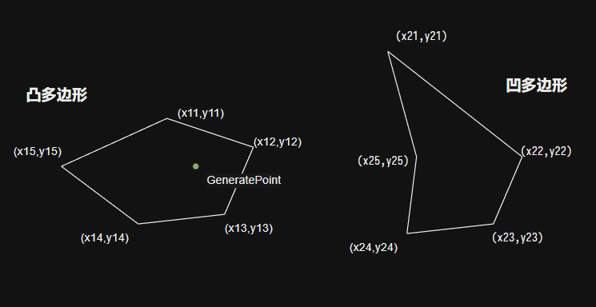
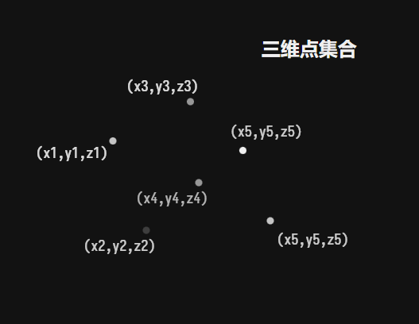
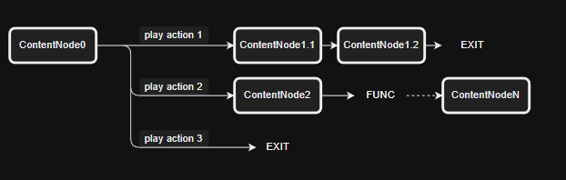

---
export_on_save:
  puppeteer: true
---

# Dragon Verse | Tables

Dragon Verse 配置表程序侧定义文档

v1.0.8  
by LviatYi

阅读该文档时，推荐安装以下字体：

- [JetBrainsMono Nerd Font Mono][JetbrainsMonoNerdFont]
- [Sarasa Mono SC][SarasaMonoSC]

## 区域 Area

| Name | PropName | Type    | Desc |
| :--: | :------- | ------- | ---- |
|  ID  | Id       | int     |      |
| 名称 | Name     | string  |      |
| 点集 | Points   | int[][] |      |

点集可以作为 **2D 形状** 或 **3D 点集合**：

- **2D 形状**
- 即当配表数据形为 $a_1|a_2|...|a_m||b_1|b_2|...|b_n$ ，其中 $m, n$ 皆为偶数时。
  - 设区域 $A$ 由 2D 形状 $S_1$ $S_2$ 构成，则:
  - $S_1$ 所包含点的数量为 $\frac m2$
  - $S_2$ 所包含点的数量为 $\frac n2$
  - $a_i,a_{i+1}$ 分别表示 $S_1$ 中第 $k$ 点 $(i=2k-1)$ 的 x、y 坐标值。
- 暂时不支持用于随机点生成.



```json
// in json

[
    [x11,y11,x12,y12,x13,y13...x1m,y1m],
    [x21,y21,x22,y22,x23,y23...x2n,y2n],
    ...
]
```

```yaml
// in config

x11|y11|x12|y12|x13|y13...x1m|y1m || x21|y21|x22|y22|x23|y23...x2n|y2n
```

- **3D 点集合**
- 即当配表数据形为 $a_1|a_2|a_3||b_1|b_2|b_3||...||k_1|k_2|k_3$ ，其一维数组的子元素为长度 3 的数组时。



```json
// in json
[
    [a_1,a_2,a_3],
    [b_1,b_2,b_3],
    ...,
    [k_1,k_2,k_3],
]
```

## 元素 Elemental

| Name | PropName | Type   | Desc |
| :--: | :------- | ------ | ---- |
|  ID  | Id       | int    |      |
| 名称 | Name     | string |      |
| Icon | Name     | string |      |

## 品质 Quality

| Name | PropName | Type   | Desc |
| :--: | :------- | ------ | ---- |
|  ID  | Id       | int    |      |
| 名称 | Name     | string |      |

## 背包物 BagItem

|   Name   | PropName   | Type    | Desc                |
| :------: | :--------- | ------- | ------------------- |
|    ID    | Id         | int     |                     |
|   名称   | Name       | string  |                     |
|   描述   | Desc       | string  |                     |
|   图标   | Icon       | string  |                     |
| 可完成性 | Achievable | boolean | 是否 可以被图鉴记录 |

## 采集物 CollectibleItem

|       Name       | PropName           | Type   | Desc   |
| :--------------: | :----------------- | ------ | ------ |
|        ID        | Id                 | int    |        |
|    背包物 ID     | BagId              | int    |        |
|     品质 ID      | QualityId          | int    |        |
| 生成区域 ID 集合 | AreaIds            | int[]  |        |
|   预制体 Guid    | PrefabGuid         | string |        |
|   最大存在数量   | ExistenceCount     | int    |        |
|     存在时间     | ExistenceTime      | int    | 秒 Sec |
|     生成间隔     | GenerationInterval | int    | 秒 Sec |
|    采集成功率    | SuccessRate        | int    | %      |
|    可采集次数    | HitPoint           | int    |        |
| 采集结果算法 ID  | ResultAlgoId       | int    |        |

## 龙 Dragon

### 龙基 Dragon (Base)

|         Name         | PropName          | Type    | Desc |
| :------------------: | :---------------- | ------- | ---- |
|          ID          | Id                | int     |      |
|         形象         | Avatar            | string  |      |
|      背包物 ID       | BagId             | int     |      |
|       元素 ID        | ElementalId       | int     |      |
|       品质 ID        | QualityId         | int     |      |
| 龙栖居地场景 ID 集合 | sceneIds          | int[]   |      |
|      可捕捉次数      | HitPoint          | int     |      |
|      翅膀 Guid       | wingGuid          | string  |      |
|    翅膀 Transform    | wingTransform     | int[][] |      |
|  捕捉成功率算法 ID   | SuccessRateAlgoId | int     |      |

- 翅膀 Transform
  - 为二维数组，长度为 3.
  - 分别为 位置 旋转 缩放.

## 采集结果算法 CollectResultAlgo

| Name | PropName | Type   | Desc |
| :--: | :------- | ------ | ---- |
|  ID  | Id       | int    |      |
| 名称 | Name     | string |      |

## 捕捉成功率算法 SuccessRateAlgo

| Name | PropName | Type   | Desc |
| :--: | :------- | ------ | ---- |
|  ID  | Id       | int    |      |
| 名称 | Name     | string |      |

## 情绪状态 Emotion

|    Name    | PropName    | Type   | Desc |
| :--------: | :---------- | ------ | ---- |
|     ID     | Id          | int    |      |
|    名称    | Name        | string |      |
| 捕捉成功率 | SuccessRate | int    | %    |

## 对话 Dialogue



### 对话内容节点 DialogueContentNode

**对话内容节点** 即对「话」的抽象。

|         Name         | PropName        | Type   | Desc              |
| :------------------: | :-------------- | ------ | ----------------- |
|          ID          | Id              | int    | 对话内容节点 Id   |
|     下条内容 Id      | NextId          | int    | 子对话内容节点 Id |
|         内容         | Content         | string |                   |
|     来源角色 Id      | SourceId        | int    | 角色 Id           |
| 对话交互节点列表 Ids | InteractNodeIds | int[]  |                   |

对于 NextId Content InteractNodeIds 分别为空，配置行的含义为：

| 置空情况 | 对话框点击反馈 | 对话内容框 | 可交互列表         | 备注         |
| -------- | -------------- | ---------- | ------------------ | ------------ |
| 000      | 无             | 隐藏       | 隐藏               | 直接退出对话 |
| 001      | 无             | 隐藏       | 显示               |              |
| 010      | 退出对话       | 显示       | 隐藏               |              |
| 011      | 无             | 显示       | 显示               |              |
| ~~100~~  | ---            | ---        | ---                | 无意义的     |
| ~~101~~  | ---            | ---        | ---                | 无意义的     |
| 110      | 显示下一条     | 显示       | 隐藏               |              |
| 111      | 显示下一条     | 显示       | Content 完整后显示 |              |

### 对话交互节点 DialogueInteractNode

**对话交互节点** 象征玩家面对来自游戏角色的话语 可选择的回应。

|      Name       | PropName      | Type   | Desc              |
| :-------------: | :------------ | ------ | ----------------- |
|       ID        | Id            | int    | 对话交互节点 Id   |
| 对话内容节点 Id | ContentNodeId | int    | 子对话内容节点 Id |
|      内容       | Content       | string |                   |
| 对话节点功能 Id | FuncId        | int    | 对话节点功能 Id   |
|      图标       | Icon          | string |                   |

对于 ContentNodeId 置空性，配置行的含义为：

- 非空 跳转到对话内容节点。
- 空 直接退出对话。

### 对话节点功能 DialogueNodeFunc

定义对话节点的附带行为。

| Name | PropName | Type   | Desc |
| :--: | :------- | ------ | ---- |
|  ID  | Id       | int    |      |
| 名称 | Name     | string |      |

## 角色 Character

**角色** 包含 玩家角色 与 非玩家角色。

| Name | PropName       | Type   | Desc |
| :--: | :------------- | ------ | ---- |
|  ID  | Id             | int    |      |
| 名称 | Name           | string |      |
| 立绘 | OriginPainting | string |      |

### NPC NonPlayerCharacter

|      Name       | PropName      | Type     | Desc            |
| :-------------: | :------------ | -------- | --------------- |
|       ID        | Id            | int      |                 |
|     角色 ID     | CharacterId   | int      |                 |
|      形象       | Avatar        | string   |                 |
|    初始位置     | Position      | vector3  |                 |
|    初始旋转     | Rotation      | rotation |                 |
|      招呼       | GreetNodeId   | int      | 对话内容节点 Id |
| 附属数据类型 ID | NpcDataId     | int      | Npc 附属数据 Id |
|    翅膀 Guid    | wingGuid      | string   |                 |
| 翅膀 Transform  | wingTransform | int[][]  |                 |

- 翅膀 Transform
  - 为二维数组，长度为 3.
  - 分别为 位置 旋转 缩放.

对于 GreetNodeId ，其指向一个 **对话内容节点** (DialogueContentNode)，且对于该节点的：

- NextId
- Content
- InteractNodeIds

属性存在数据校验要求，且不同值适用于不同场合。

| 置空情况 | 屏幕点击反馈 | 对话内容框 | 可交互列表         | 备注     |
| -------- | ------------ | ---------- | ------------------ | -------- |
| ~~000~~  | ---          | ---        | ---                | 无意义的 |
| 001      | 无           | 隐藏       | 显示               | **招呼** |
| 010      | 退出对话     | 显示       | 隐藏               | **打劫** |
| 011      | 无           | 显示       | 显示               | **打劫** |
| ~~100~~  | ---          | ---        | ---                | 无意义的 |
| ~~101~~  | ---          | ---        | ---                | 无意义的 |
| 110      | 显示下一条   | 显示       | 隐藏               | **打劫** |
| 111      | 无           | 显示       | Content 完整后显示 | **打劫** |

- **招呼**
  - **常用的**。
  - 不会强制锁定玩家视角。
  - 玩家可以选择交互节点 以进一步对话 从而锁定玩家视角。
- **打劫**
  - 强制锁定玩家视角。玩家被强制拉入对话。
  - 提供或不提供交互节点。
    > 到了江心 且问你吃板刀还是馄饨

### NPCData NonPlayerCharacterData

| Name | PropName | Type   | Desc |
| :--: | :------- | ------ | ---- |
|  ID  | Id       | int    |      |
| 名称 | Name     | string |      |

## 任务 Task

|      Name       | PropName        | Type    | Desc                    |
| :-------------: | :-------------- | ------- | ----------------------- |
|       ID        | Id              | int     |                         |
|      名称       | Name            | string  | 备注用 无需填入 lan_key |
|    子项目数     | Count           | int     | 完成所达成数量          |
|    可重复性     | Repeat          | boolean | 可否重复完成            |
|    完成奖励     | Reward          | int[][] |                         |
| Quest 物体 Guid | QuestObjectGuid | string  |                         |

- 完成奖励
  - `[(int,int)*,int][]`
  - 如 `10|1|1||11|1|12|10|2`
    - 这意味着有两组任务奖励。
    - A 组 为 1 个物品 10
    - B 组 为 1 个物品 11 与 10 个物品 12
    - 选择 A 组的概率 **权重** 为 1
    - 选择 B 组的概率 **权重** 为 2
  - 元素含义为：[(**背包物品 id**,数量),权重]
  - 其中 **背包物品 id** 与其对应的数量可以包含多个。
  - **权重 (weight)** 用于计算任务奖励的选择概率。具体选择 $k$ 元素概率为：

$$
\frac{\text{weight}_k}{(\sum_{i=1}^n \text{weight}_i)}
$$

- Quest 物体 Guid
  - 构建场景时 需将 Quest 预制体拖入场景，并填入其 Guid。

## 动物生态 AnimalEcology

|       Name       | PropName            | Type   | Desc               |
| :--------------: | :------------------ | ------ | ------------------ |
|     动物 ID      | id                  | int    |                    |
|       名称       | name                | string |                    |
|     生成区域     | generationAreas     | int[]  | 目前仅支持点集区域 |
| 生成起始时间 ms  | startGenerationTime | int    |                    |
| 单次生成间隔 ms  | generationInterval  | int    |                    |
|   单次生成数量   | generationCount     | int    |                    |
| 自动消失时长 ms  | fadeTime            | int    |                    |
|     运动范围     | movementRadius      | int    |                    |
| 寻路范围可采样值 | pathFindRadius      | int[]  |                    |
| 速度可采样值 m/s | speed               | int[]  |                    |
| 休憩时长可采样值 | restTime            | int[]  |                    |
|   预制体 Guid    | prefabGuid          | string |                    |

- **movementRadius** 以生成区域为中心 在运动范围内的寻路点有效。
- **pathFindRadius** 自动寻路的距离 从中采样下次运动的目标点。
- **speed** 运动速度 从中采样下次运动的速度。
- **restTime** 休憩时长 从中采样下次休憩的时长。休憩完成后开始采样下一个运动采样。
  - 采样有效则进行下一次运动。
  - 否则进行下一次休憩。

[JetbrainsMonoNerdFont]: https://github.com/ryanoasis/nerd-fonts/releases/download/v3.0.2/JetBrainsMono.zip@fallbackFont
[SarasaMonoSC]: https://github.com/be5invis/Sarasa-Gothic/releases/download/v0.41.6/sarasa-gothic-ttf-0.41.6.7z
